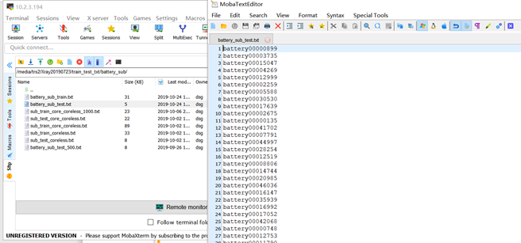
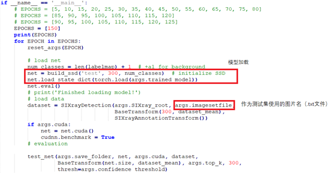
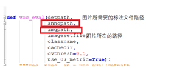

# 需要修改的部分

修改后运行`eval_5epoch_for.py`文件

* `line 592` 模型加载部分：这部分需要修改成自己的网络架构
* 核查图片路径和标签路径。如果图片和标注文件的路径不对，需要修改`line 82 - 85`

不确定的地方

* `line 600` `args.imagesetfile`是作为测试集使用的图片名（`.txt`文件）→ 应该修改的是`line 42 -  65`部分的`parser`属性

下面是大作业的原文

# 模型测试

测试需要的文件包括：

1. 作为测试集使用的图片名（.txt文件）

   

2. 图片所在的路径

3. 图片所需要的标注文件路径

## 输入要求

**框架要求：pytorch 0.4及以上**

**要求：**

测试文件的输入要包含一个txt文件（里面是测试集的图片名，见问题描述），测试图片所在文件夹的路径，测试图片的标注文件所在文件夹的路径。

举个例子：

大家可以把我们给的测试文件中的模型加载部分改成自己的网络架构。之后可以尝试直接使用我们给的测试文件进行测试。

## 模型提交方式

各组创建一个自己的github网址，上传自己的代码和训练好的模型，我们会使用提交代码中的测试文件和模型来对测试集进行测试，github网址会在群里进行统计。

 

另外还需提交作业报告，报告中需要介绍自己所使用的模型和方法。

## 作业期限

第15周结束，12月13号

# 注意

**数据集图片严禁上传到github等在线平台，严禁在网上四处传播。违反者成绩按0分处理。**